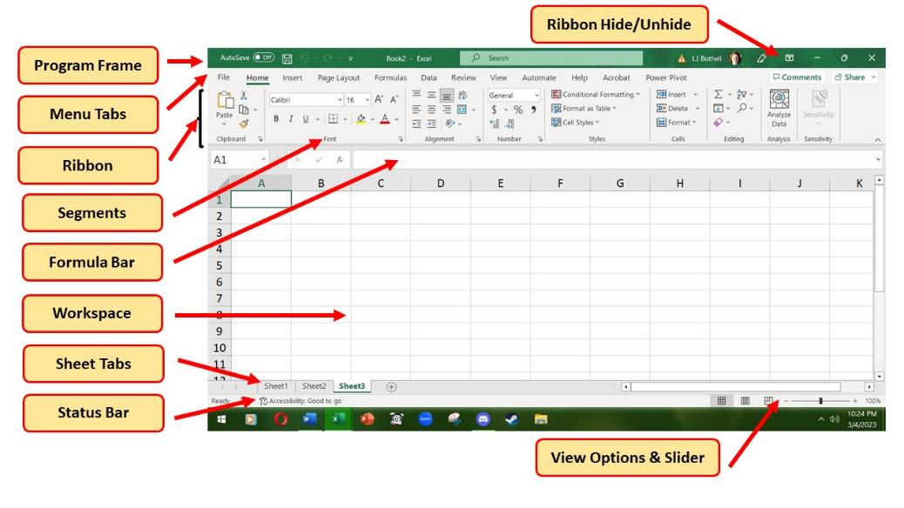
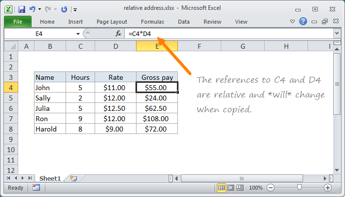
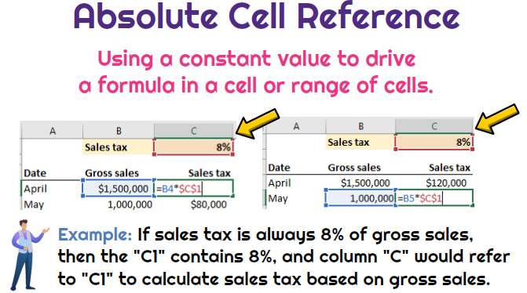
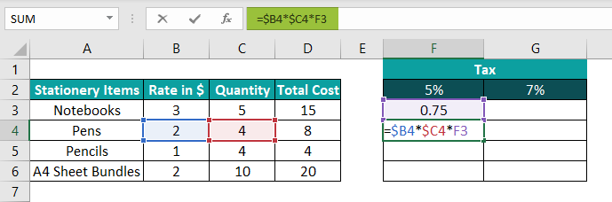

# Chapter 1 - Excel Foundation

# Excel Fundamentals

## 1.1. WHAT IS MICROSOFT EXCEL?
- More than just rows and columns — Excel is your everyday data superpower

#### Excel UseCase
1. Excel is a spreadsheet tool
   - Used to store, organize, and analyze data
2. It helps you see patterns
    - Through charts, graphs, conditional formatting
3. It can do the math for you
    - From simple sums to complex formulas
4. Used across industries
    - In business, science, healthcare, marketing, HR, and more
---

## 1.2. What is workbook and Worksheet?
1. Workbook
    - Entire Excel File
    - It is like a binder
    - one or more worksheets

2. WorkSheets
    - 1 page in workbook
    - Labeled as Sheet1, Sheet2, etc.. at the bottom
    - All Excel Work is done here
---

## 1.3. Exploring Excel Interface

 \
[👆 Excel Interface](images/excel_interface.jpeg)

* **Program Frame** - Your file's name lives here.
* **Menu Tabs** - Jump to the tools you need.
* **Ribbon** - All your Excel powers in one place.
* **Segments** - Rows + columns = your data playground.
* **Formula Bar** - Where the smart stuff happens.
* **Workspace** - Your main data canvas.
* **Sheet Tabs** - Flip between sheets like pages.
* **Status Bar**- Quick stats, always at a glance.
* **View Options & Slider** - Zoom in, zoom out, your call .
* **Ribbon Hide/Unhide** - More space, less clutter.
---

## 1.4. Excel Shortcuts
Basic Navigation Shortcuts

| **Action**          | **Shortcut**   |
|---------------------|----------------|
| Select all          | Ctrl + A       |
| Save                | Ctrl + S       |
| Undo                | Ctrl + Z       |
| Redo                | Ctrl + Y       |
| Edit a cell         | F2             |
| Move to end of data | Ctrl + up/down |
| Copy                | Ctrl + C       |
| Paste               | Ctrl + V       |
---

## 1.5. Data Entry, Selection tricks, Autofill, Flask Fill

1. **Data Entry & Navigation**
   * Click into any cell and start typing
   * Use Enter, Tab, and Arrow Keys for fast navigation
   * Use Ctrl + Shift + to select down large lists

2. **Autofill**
    * Type "Goa", "Manali"... drag to fill more destinations
    * Dates, numbers, or repeating text auto-expand
---

## 1.6. Formating numbers, dates, currency
  1. Select the cells you want to format.
  2. Go to the Home tab on the ribbon.
  3. In the Number group, click the dropdown
  4. arrow next to the number format box.
  5. Select your desired formatting option like
  6. Number, Currency, Short Date, Long Date, etc.
  7. Choose the desired format from the
  8. options and Click 0K.
---

## 1.7.Introduction to Ranges & Named Ranges

1. **Part 1: What is a Range?**
    - A range is simply a group of selected cells — like A1 to A5 or B2 to DIO.
    - Ranges can be rows, columns, or any rectangular block of cells. You use them in formulas, charts, and more.

2. **Part 2: What is a Named Range?**
    - Anamedrangelets yougive a friendly name to a range — like 'Sales2024' instead of B2:BIO.
    - This makes formulas easier to read and reduces errors in complex workbooks.

    **Steps to Create a Named Range**
    1. Select the range of cells.
    2. Go to the Formulas tab.
    1. Click Define Name (or use the Name Box next to the formula bar).
    2. Enter a meaningful name (no spaces).
    3. Click 0K.
---

## 1.8. Cell Referenceing (Relative, Absolute, Mixed)
1. **Relative Reference (A1)**
    - This is the default. 
    - When you copy the formula, Excel adjusts the reference based on the position.
    - **Example behavior:**
        - Copy =C4+D4 from row 1 to row 2
        - It becomes =C4*D4  
 \
[👆 Relative Reference](images/relative_refernce.png)

2. **Absolute Reference (\$A\$1)**
    - This locks both the column and the row — no matter where you move or copy the formula, it always points to the same cell.
    - **Example behavior:**
        - copy = B1 + \$A\$1 -> \$A\$1 always points to the same cell even through you drag column for autofill
 \
[👆 Absolute Reference](images/absolute_reference.png)

3. **Mixed Reference (\$A1 or A$1)**
    - Mixed referencing lets you lock either the column or the row — not both.
    - **Types:**
        - $A1 -> Column A is fixed, row can change
        - A$1 -> Row 1 is fixed, column can change
 \
[👆 Mixed Reference](images/mixed_refernce.png)
---

#### Summary - Excel Fundamentals
1. What is MS Excel ?
2. Workbook VS Worksheet, Excel Interface
3. Basics - Data entry, Autofill, Formatting, Ranges and Named ranges.
4. Cell Referencing - Relative, Absolute and Mixed
---

## Task
Task 1 - Know all teh shorctus
