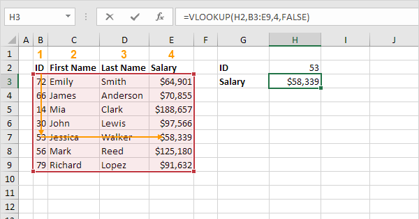
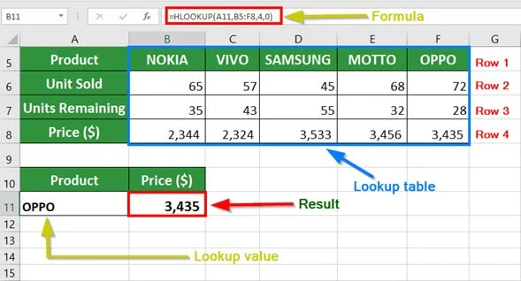
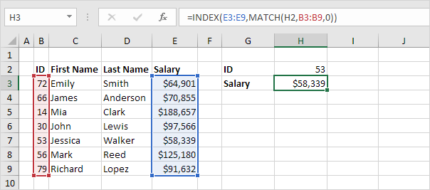
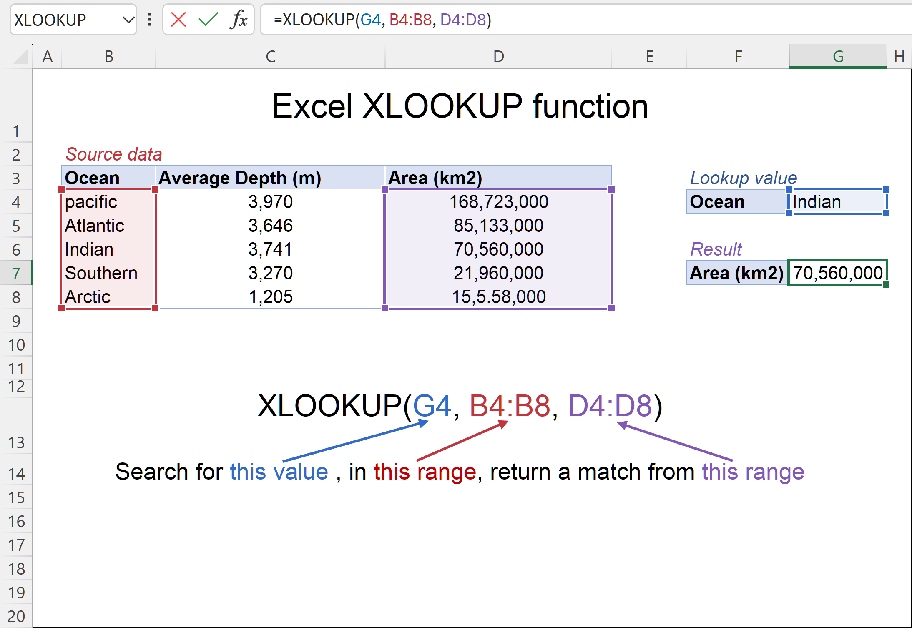

# Chapter 3 - Lookup and Reference

For Logical Operator refer the ([Chapter 2](../Chapter_2_Arithemetic_and_Conditional_Operators/file_1.md)) Notes and Then Continue here

## Lookup and Reference

**Why Lookup Functions Matter:**
* Saves hours of scrolling and searching
* Powers real-world tools like attendance trackers, stock checkers customer dashboards.
* Helps automate reports and summaries with accuracy

**Key Lookup Functions Explained**
1. **VLOOKUP (Vertical Lookup)**
   - Searches down a column to find a value and returns data from another column.
    - **Syntax:**
        `=VLOOKUP(lookup_value, table_array, col_index, [range_lookup])`    
    - Use when data is arranged vertically (top to bottom).
    
    [👆 VLookUp](images/v_lookup.png)
 

2. **HLOOKUP (HorizontalLookup)**
   - Searches across a row and returns a value from a different
   row.
   - **Syntax:**
        `=HLOOKUP(lookup_value, table_array, row_index, [range_lookup])`
   - Use when data is laid out in rows (left to right).
    
    [👆 HLookUp](images/h_lookup.png)
 

3. **INDEX + MATCH (More flexible alternative to VLOOKUP)**
   - INDEX returns the value at a given row and column;
   - MATCH finds the position of a value.
   - **Combined Syntax:**
    `=INDEX(return_range, MATCH(lookup_value, lookup_range, O))`
   - More dynamic. Works left-to-right, right-to-left, even with inserted columns.
    
    [👆 Index + Match](images/index_match.png)
 

4. **XLOOKUP (The modern all-in-one lookup tool)**
    * Replaces VLOOKUP & HLOOKUP. Searches, arange and returns a corresponding value.
    * **Syntax:**
        `=XLOOKUP(lookup_value, lookup_array, return_array,[if_not_found])`
    * Simpler, more powerful, and doesn't require column/row numbers.
    
    [👆 XLookUp](images/x_lookup.png)

#### Summary - LooKup and Reference
1. Logical Operators - AND, OR, ISBLANK
2. Data cleaning - LEFT, RIGHT, MID, CONCATENATE, TEXT JOIN, CONCAT
3. DataSet Practice
4. LOOKUP Theory