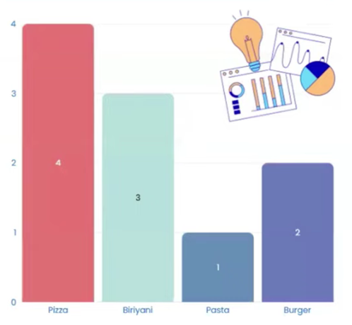
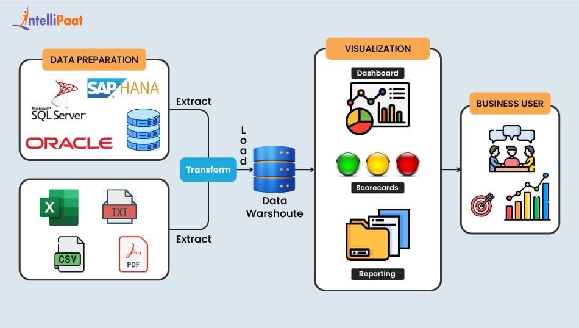

# Chapter 1 - Business Intelligence
## 1. Business Intelligence
#### What Is It & Why Does It Matter?
- **Business Intelligence** is the process of collecting data, organizing it, visualizing it, and using it to understand what is happening in a business
- This process of turning raw numbers into meaningful insights collect is called **Business Intelligence.**
---

#### Uses of Business intelligence
- **Better Decision-Making:** 
  - BI helps businesses make decisions based on facts, data, and insights rather than guesswork
- **Identify Trends & Opportunities:** 
  - BI tools show patterns in customer behavior, sales, and market changes so businesses can act early
- **Improve Efficiency:** 
  - BI reveals bottlenecks, delays, and inefficiencies in processes so companies can optimize them.
- **Real-Time Performance Monitoring:** 
  - With dashboards, BI helps track KPIs, sales, revenue, expenses, and targets instantly
---

#### Data Visualization
- Data Visualization turns complex data into simple, visual stories that people can easily understand.

**Example**
  - Imagine you ask your friends about their favorite food and you make a note of their answers

| Name | Favorite Food |
| --- | --- |
| Arjun | Pizza |
| Sneha | Biryani |
| Karan | Pizza |
| Meera | Burger |
| Rahul | Pasta |
| Divya | Biryani |
| Varun | Pizza |
| Priya | Burger |
| Sudeep | Pizza |
| Ananya | Biryani |
- Looking at this raw list, it's hard to quickly understand:
    - Which food is liked the most?
 \
[👆 Food Count vs Friends](images/name_food_chart.png)

- Which food is most liked ?
    - They 'II instantly say Pizza, because the bar is longest
---
## 1.1. Power BI
#### Why do we need a tool like Power Bi?
- Instead of 10 people, you had data from 10,000 people.
- Their responses were spread across multiple files and systems.
- You wanted to compare food preferences by city, age group, or season.
- And you needed your charts to update automatically whenever new
data arrived.

**That's when manual methods fail - and a powerful BI tool becomes essential**
- This is were **PowerBI** comes in
- Power Bl is a tool from Microsoft that helps you collect, clean, and turn data into interactive charts, reports, and dashboards-so you can discover insights and make beaer clecisäons.
    - It's like giving your data superpowers.

|  |  |
| --- | --- |
| **Power Bl Is Like   Excel ... But on Steroids** | **It Connects to Everything** |
| Excel = great for static data.   Power BI = dynamic, interactive real-time insights | No more copying and pasting.   Just connect and go |
|  |  |
| **Dashboards   It's Powerful ... and Anytime, Anywhere** | **It's Powerful ... and Affordable** |
| Check your sales report on your phone | Why pay more when you get enterprise-grade power for less? |
|  |  |
| **Interactive Dashboards   That Tell Stories **| **Backed by Microsoft** |
|Tools like Google Data Studio are decent-but Power Bl's interactivity is next-level | If your company already uses Microsoft tools. Power BI fits like a glove |
---

## 1.2. Components of Power BI
| Component | Purpose (Simple Explanation) | Free or Not? |
| --- | --- | --- |
| **Power BI Desktop** | Create reports, clean data, build visuals, data modeling. | Free |
| **Power Query** | Clean, transform, and prepare data.   Built inside Power BI Desktop & Excel. | Free (inside Desktop) |
| **Power Pivot** | Create data models, relationships, calculations inside Excel/Power Bl. | Free (inside Desktop) |
| **Power View** | Create interactive visualizations inside Excel/SharePoint (old feature). | Free (but deprecated) |
| **Power Map** | 3D geographic visualizations (Excel Add-in). | Free (in some Excel versions) |
| **Power BI Service**   (Cloud)| Publish, share, collaborate, schedule refresh. | Partially Free - Free for personal use;   Pro/Premium needed for sharing |
| **Power BI Q&A** | Ask questions in natural language to generate visuals instantly. | Not Free (Requires Power BI Service Pro/Premium) |
| **Data Catalog** | Helps catalog, store, and share data sources inside the organization. | Not Free (Enterprise feature) | 
| **Data Management Gateway** | Connects on-premise data to cloud for auto refresh. | Free, but requires Pro/Premium features to schedule refresh in Service.|
---

## 1.3. PowerBI Architecture
 \
[👆 PowerBI Architecture](images/powerbi_architecture.png)

- **Data Sources:** The locations where all raw data is stored
- **Extract:** Bringing data from different sources into Power BI.
- **Transform:** Cleaning and preparing the data for analysis.
- **Load:** Storing the cleaned data inside the data model.
- **Visualize:** Creating meaningful dashboards and reports.
- **Business Users:** Using these insights to make better decisions.
---