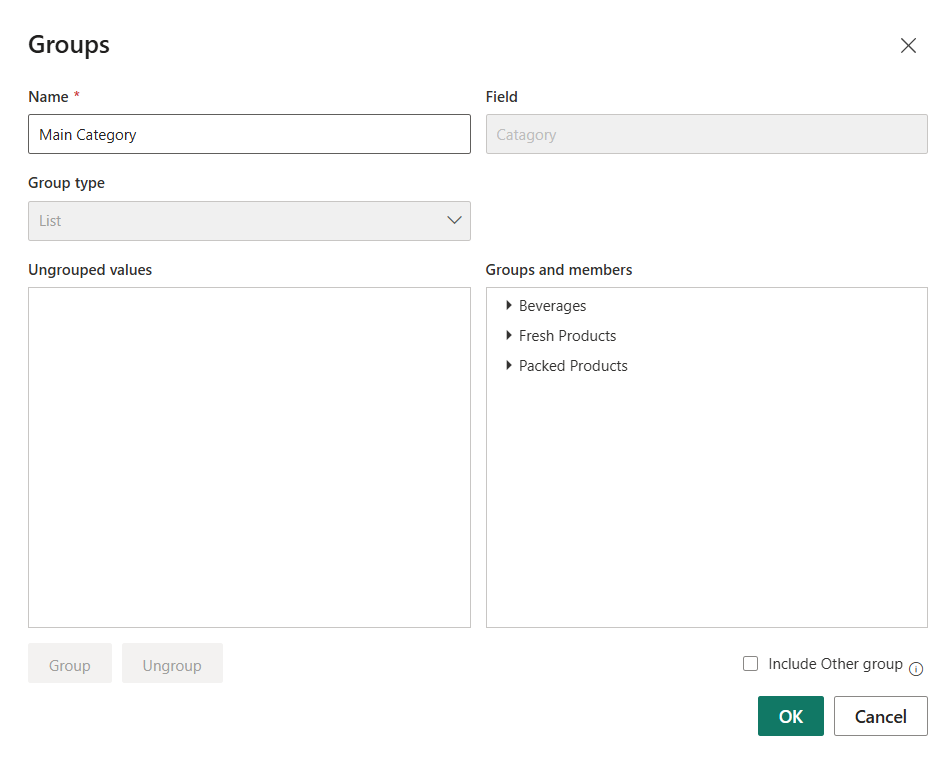
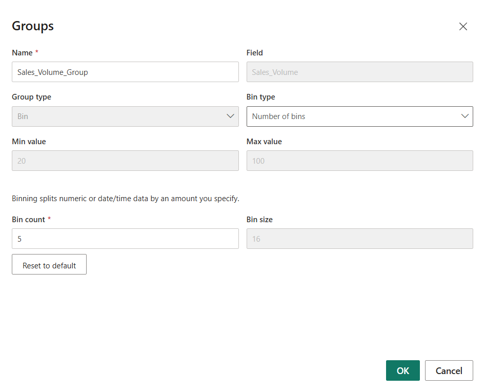

# Chapter 6 - Groups

- Groups help you combine multiple category values into one single group
- They simplify your visuals by reducing too many categories into clear segments
- Groups work like a quick IF condition without writing DAX, useful for text/list fields

---

#### Steps for Text Category
1. Select the column which need to group (category)
2. Right colum -> Group
3. Rename the **New Column Name**
4. pressing **ctrl** for selecting multiple category
5. after selecting for one main category -> Click group
6. Double click on the main group name to remame
7. do the the same for creating other group also
8. At last click **Ok**
 \
[👆 Text Category Group Inteface](images/text_category_group_interface.png)

#### Step for Number Category

 \
[👆 Text Category Group Inteface](images/num_category_group_interface.png)