# Chapter 8 - Visualization

## Business Questions
1. Which Category generates the highest Total Sales?
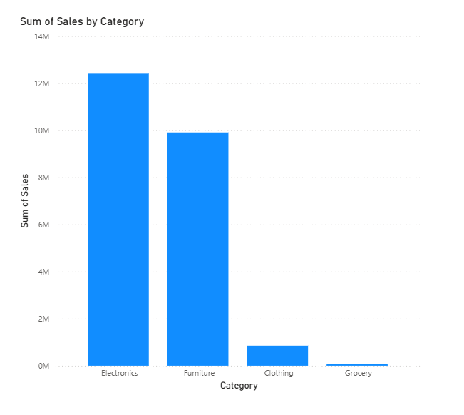

2. Which SubCategory performs the best in terms of Sales?
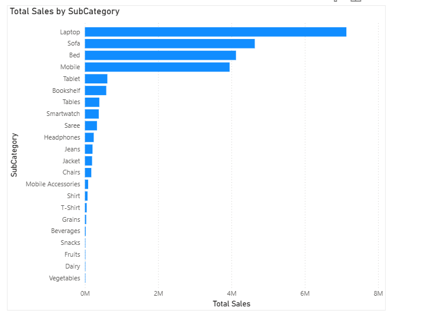

3. What are the key KPIs? (Total Sales, Profit, Quantity, Profit %)
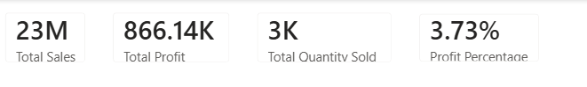

4. Which Category contributes the highest Profit %?
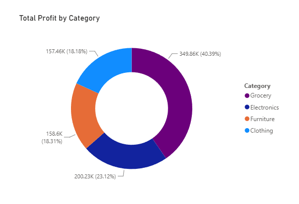

5. How do Sales trend over time (monthly)?
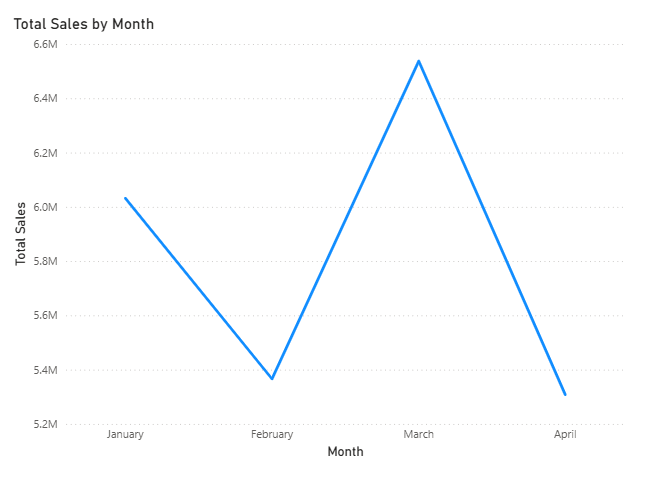

6. How do Sales and Profit compare month-over-month?
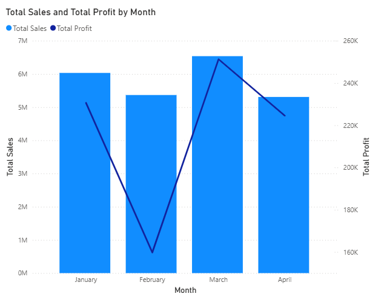

7. Which are the Top 1O best-selling Products?
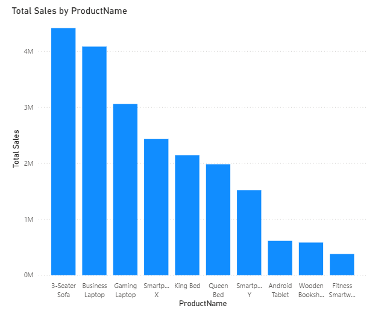

8. Which products sell the highest quantity?
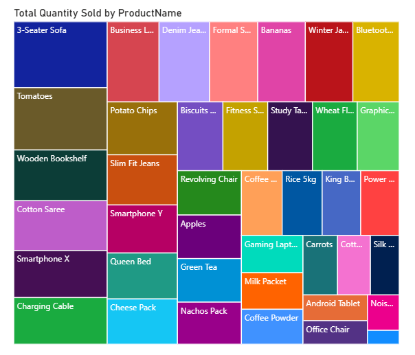

9.  How does Sales / Profit / Quantity break down across Category -> SubCategory -> Product?
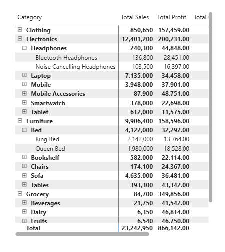

10. Which Products have high or low Profit visually?
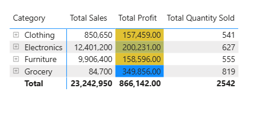
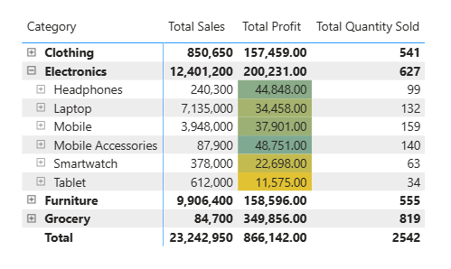
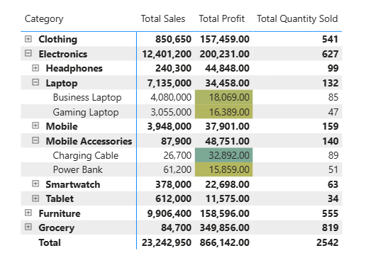

1.  What are the detailed metrics (Sales, Profit, Profit %, Quantity) for a specific Product when hovered?
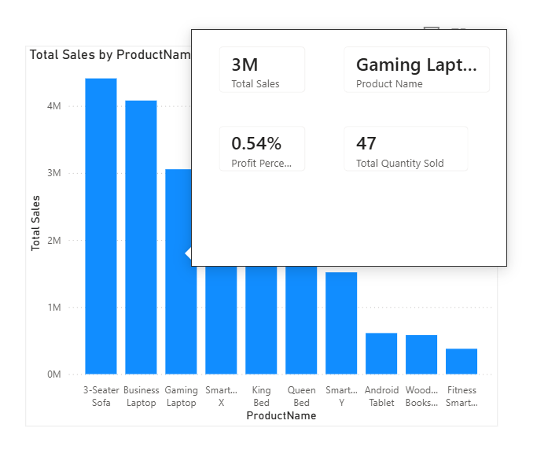
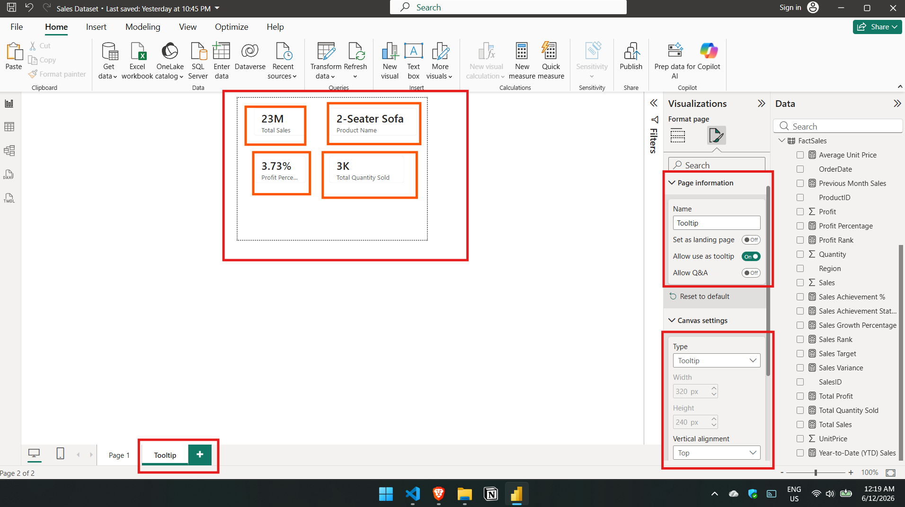
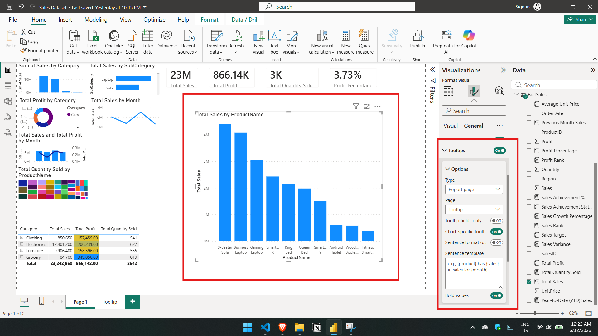

1.  How can users filter the entire report by Date, Region, or Category?
(Use Slicers)
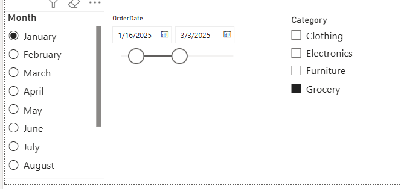