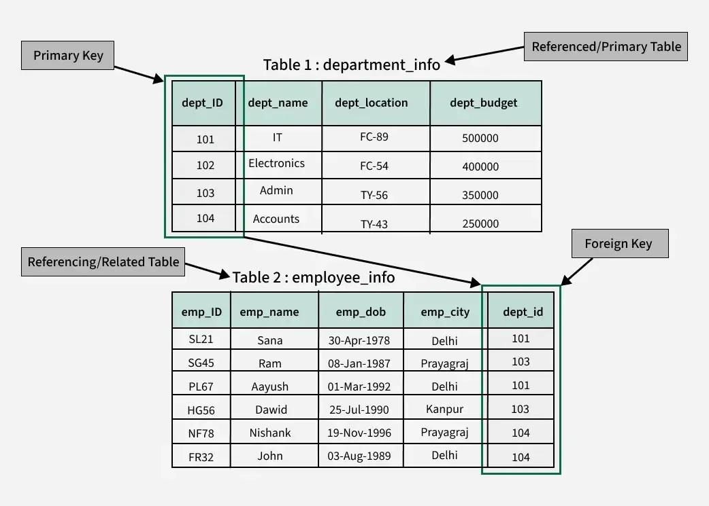

# Chapter 1 - Installing MYSQL & Creating DBS

#### Agenda at a glance

1. Installing MySQL
2. Creating a DB
3. Theory

---

## 2. Creating a DB

#### 1. Create Database

```sql
CREATE DATABASE studentsdb;
```

**Explanation**

- `CREATE DATABASE` is used to create a new database.
- `studentsdb` is the name of the database.

---

#### 2. Select the Database

```sql
USE studentsdb;
```

**Explanation**

- `USE` selects a database for performing operations.
- After executing this command, all tables will be created inside `studentsdb`.

**Purpose**

Makes `studentsdb` the active database.

---

#### Create Students Table

```sql
CREATE TABLE students(
    studentid INT AUTO_INCREMENT PRIMARY KEY,
    firstname VARCHAR(50),
    lastname VARCHAR(50),
    birthdate DATE,
    gender VARCHAR(10)
);
```

**Explanation of Columns**

| Column Name | Data Type   | Description                |
| ----------- | ----------- | -------------------------- |
| studentid   | INT         | Unique ID for each student |
| firstname   | VARCHAR(50) | Student's first name       |
| lastname    | VARCHAR(50) | Student's last name        |
| birthdate   | DATE        | Student's date of birth    |
| gender      | VARCHAR(10) | Student's gender           |

**Important Keywords**

##### `AUTO_INCREMENT`

- Automatically generates a new ID for each record.
- Starts from 1 and increases by 1.

##### `PRIMARY KEY`

- Uniquely identifies each row.
- Cannot contain duplicate values.
- Cannot be NULL.

---

#### Create Courses Table

```sql
CREATE TABLE courses(
    courseid INT AUTO_INCREMENT PRIMARY KEY,
    coursename VARCHAR(50),
    credits INT
);
```

**Explanation of Columns**

| Column Name | Data Type   | Description                |
| ----------- | ----------- | -------------------------- |
| courseid    | INT         | Unique ID for each course  |
| coursename  | VARCHAR(50) | Name of the course         |
| credits     | INT         | Credit value of the course |

---

#### Create Enrollment Table

```sql
CREATE TABLE enrollment(
    enrollmentid INT AUTO_INCREMENT PRIMARY KEY,
    studentid INT,
    courseid INT,
    enrollmentdate DATE,
    FOREIGN KEY(studentid) REFERENCES students(studentid),
    FOREIGN KEY(courseid) REFERENCES courses(courseid)
);
```

**Explanation of Columns**

| Column Name    | Data Type | Description                    |
| -------------- | --------- | ------------------------------ |
| enrollmentid   | INT       | Unique enrollment ID           |
| studentid      | INT       | Student enrolled in a course   |
| courseid       | INT       | Course selected by the student |
| enrollmentdate | DATE      | Date of enrollment             |

---

##### Foreign Keys

**Foreign Key: Student**

```sql
FOREIGN KEY(studentid)
REFERENCES students(studentid)
```

**Purpose**

Creates a relationship between:

- `enrollment.studentid`
- `students.studentid`

**Benefit**

- Only existing students can be enrolled.

---

##### Foreign Key: Course

```sql
FOREIGN KEY(courseid)
REFERENCES courses(courseid)
```

**Purpose**

Creates a relationship between:

- `enrollment.courseid`
- `courses.courseid`

**Benefit**

- Only existing courses can be assigned to students.

---

### Relationship Type

- One Student → Many Enrollments
- One Course → Many Enrollments
- Students ↔ Courses = Many-to-Many Relationship (through Enrollment table)

---

## Theory

#### Important Terminologies

- **Primary key**
    - A unique identifier for each row in a table, ensuring that each row is distinct.
- **Foreign Key**
    - A column ore set of columns in one table that referes to the primary primary key in another table, establishing a relationship between the two tables

 \
[👆 Primary key and Foreign Key](images/primary_and_foreign_key.png)

---

#### Data Types

1. **Numeric Data Types**
    - **Integer**
        - **Int**: Standard whole numbers `(e.g., 123)`.
        - **BigInt**: Large whole numbers `(e.g., 123466789456)`.
    - **Floating**
        - **Float**: Approximate decimal values `(e.g., 3.15)`.
        - **Double**: Higher precision approximate decimals `(e.g., 3.145835)`.
    - **Fixed Point**
        - **Decimal(p,s)**: Exact numerical values; ideal for financial calculations `(e.g., Decimal(10,2) outputs 12345678.90)`.

2. **String Data Types**
    - **Character**
        - **Char(n)**: Fixed-length character string `(e.g., 'OpenAI')`. Pad spaces if shorter than n.
        - **VarChar(n)**: Variable-length character string `(e.g., 'Hello World')`. Saves storage space.
    - **Text**
        - **Text**: Long-form string data for large blocks of prose `(e.g., 'Hii this is an example for the text')`.

3. **Date & Time Data Types**
    - **Date**: Stores date only `(Format: YYYY-MM-DD, e.g., 2024-11-01)`.
    - **Date Time**: Stores both date and time `(Format: YYYY-MM-DD HH:MM:SS, e.g., 2024-11-01 12:30:45)`.
    - **Timestamp**: Stores tracking data for exact moments in time, often timezone-aware `(Format: 2024-11-01 12:30:45)`.

4. **Boolean Data Type** - **Boolean**: Represents logical binary truth values. - `True - False`
   <br>
5. **Semi-Structured Data Types**
    - **JSON**: Key-value data formats `(e.g., { "Key": "Value" })`.
    - **XML**: Document-based markup tags `(e.g., <note><to>User</to><body>Hello</body></note>)`.

6. **Financial Data Type**
    - **Money**: Optimized numeric structure specifically for monetary values `(e.g., $ 200)`.

---


## SQL keywords 

--> need to find 
